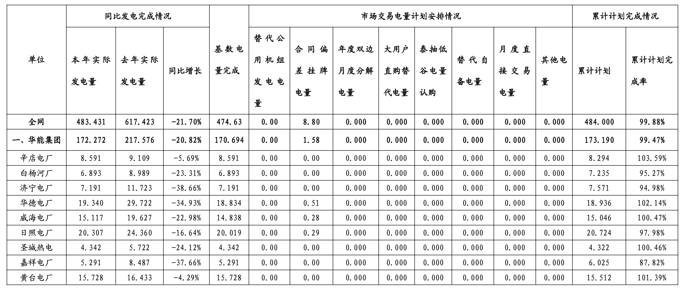
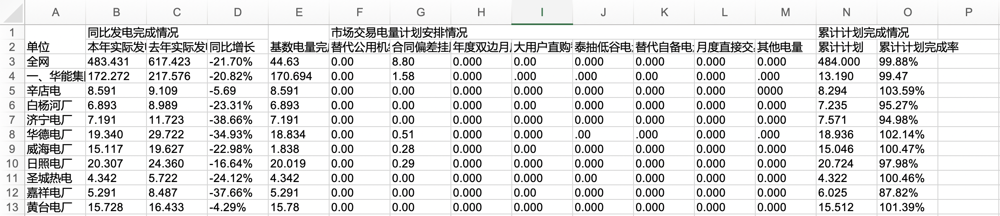

# Table OCR

## Table of Contents

- [Introduction](#introduction)
- [Structure](#structure)
- [Config](#config)
- [Setup](#setup)
- [StartOCR](#startocr)
- [Example](#example)
- [Requirements](#requirements)


## Introduction
The script is converts all of the pictures in a directory into excel tables. The intended language for the tables is Chinese.
The underlying OCR engine is [Baidu OCR](https://cloud.baidu.com/doc/OCR/s/Ek3h7yeiq).

## Structure
```
.
├──table_ocr
│  └── LICENSE
│  └── README.md (doc file)
│  └── run.py  (main file to initiate script)
│  └── table_script.py (source code for the script)
|  └── Example_image (pictures for the readme file)   
└── ...
```


## Config

User need to first obtain the tokens for the [Baidu cloud api](https://cloud.baidu.com/doc/OCR/s/dk3iqnq51). Follow the instructions in the link and create an account. Register an app to get APP ID, API KEY and SECRET KEY. Fill in the information in the `table_script.py`.

```
APP_ID = ''
API_KEY = ''
SECRET_KEY = ''
```
## Setup

To install the Baidu OCR platform, run `pip install baidu-aip`.

## StartOCR

Navigate to the package directory and run the command
```
python run.py input_path output_path
```

`input_path` and `output_path` both need to be absolute path for directories. The script will convert each file to xls format with the same file name.

## Example
Original image

Output xls file



## Requirements
- python3
- request
- os
